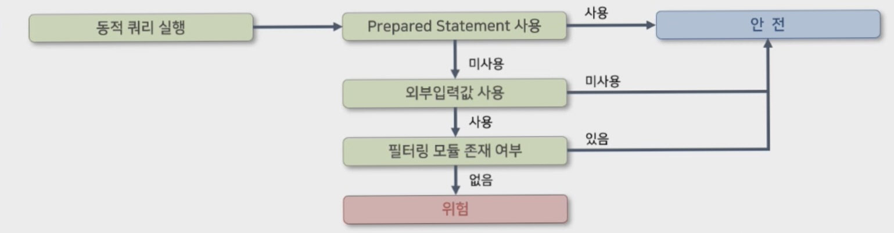
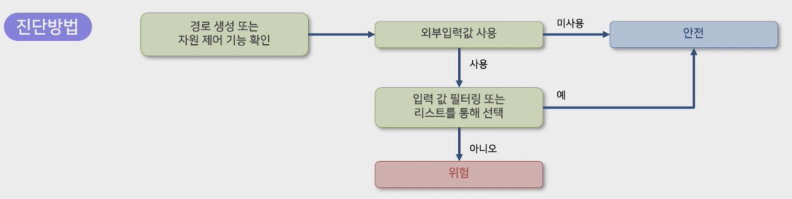
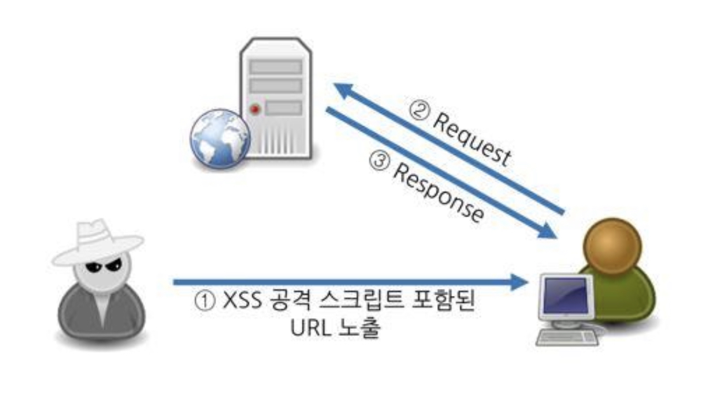
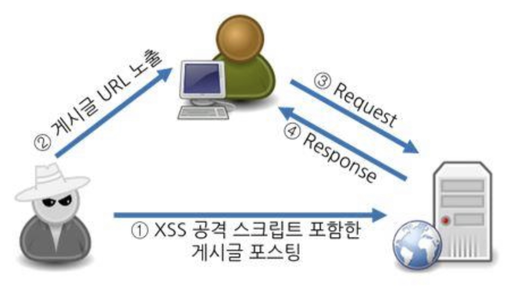
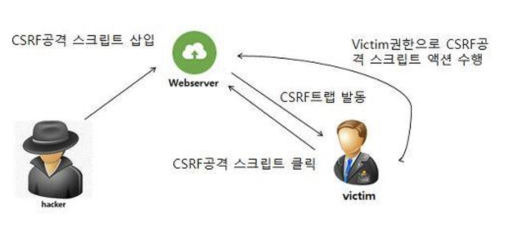

# 8. 4 주요 SW보안약점 교육내용 정리 

## 1. SQL 삽입

### 원인
DB와 연동된 웹 응용프로그램에서 입력된 데이터에 대한 유효성 검증을 하지 않고 입력값을 DB 쿼리 일부로 사용하는 경우

### 영향 
- 인증을 우회해 시스템에 로그인 가능
- 조작된 쿼리를 이용해 권한 없는 사용자가 DB데이터를 유출, 수정, 삭제 가능
- 저장 프로시저를 호출해 원격으로 시스템 명령어를 수행할 수 있음

### 대응 
- 정적 쿼리를 사용해 쿼리문의 구조가 바뀌지 않도록 하기
- 동적 쿼리를 사용해야 하는 경우, 입력값에 쿼리문의 구조를 변경할 수 있는 문자열을 검사한 후 쿼리문 생성에 사용
- 웹 어플리케이션에서 사용하는 DB 사용자 권한을 최소화

### 진단 방법 

<div style="text-align:center">

</div>

```
// 안전하지 않은 코드 예시
/// 외부로부터 입력 받은 값을 검증없이 사용할 경우 안전하지 않다.
String gubun = request.getParameter("gubun");
...
String sql = "SELECT * FROM board WHERE b_gubun = '" + gubun + "'";
Connection con = db.getConnection();
Statement stmt = con.createStatement();
/// 외부로부터 입력 받은 값이 검증/처리 없이 쿼리로 수행되어 안전하지 않다.
ResultSet rs = stmt.executeQuery(sql);
```
```
// 안전한 코드 예시 (JDBC API 사용 전제)
...
/// 사용자에 의해 외부로부터 입력 받은 값은 안전하지 않을 수 있으므로, PreparedStatement 사용을 위해 ?문자를 바인딩 변수로 사용한다.
String sql = "SELECT * FROM board WHERE b_gubun = ?";
Connection con = db.getConnection();
/// PreparedStatement 를 사용한다.
PreparedStatement pstmt = con.prepareStatement(sql);
/// PreparedStatement 객체를 상수 스트링으로 생성하고, 파라미터 부분을 setString 등의 메소드로 설정한다.
pstmt.setString(1, gubun);
ResultSet rs = pstmt.executeQuery();
```

## 3. 경로조작 및 자원삽입

### 원인
검증되지 않은 외부 입력값이 파일 및 서버의 시스템 자원외 접근되거나, 식별에 이용하는 경우

### 영향
- 공격자는 입력값을 조작해 시스템이 보호하는 자원에 임의로 접근 가능
- 공격자는 허용되지 않은 권한을 획득하거나, 인증이나 인가를 우회해 설정에 관계된 파일을 열람/변경/실행할 수 있음

### 대응
- 외부 입력값을 자원의 식별자로 이용하는 경우, **철저히 검증**을 수행한 후 사용
- **사용자별로 사용 가능한 자원을 사전에 리스트로 정의**해 사용범위를 제한
- 파일을 사용하는 경우, **파일명에 경로 순회공격 위험이 있는 문자(.. / ₩ ")를 제거**하는 필터를 이용

### 진단 방법
<div style="text-align:center">

</div>

```
// 안전하지 않은 코드
/// 외부로부터 입력받은 값을 검증없이 사용하는 경우 안전하지 않음
String fileName = request.getParameter("P");
BufferedInputStream bis = null;
BuffferdOutputStream bos = null;
FileInputStream fis = null;
try {
    response.setHeader("Content-Disposition", "attachment;filename="+fileName+";");
    /// 외부로부터 입력받은 값이 검증/처리 없이 파일처리에 수행되버림
    fis = new FileInputStream("C:/datas/"+fileName);
    bis = new BufferedInputStream(fis);
    bos = new BufferedOutputStream(response.getOutputStream());
    ...
```
```
String fileName = request.getParameter("P");
BufferedInputStream bis = null;
BufferedOutputStream bos = null;
FileInputStream fis = null;
try {
    response.setHeader("Content-Disposition","attachment;filename="+fileName+";");
    /// 외부로부터 입력받은 값은 경로 순회 문자열(.. / ₩ ")을 제거하고 사용해야 함
    fis = new FileInputStream("C:/datas/"+fileName);
    bis = new BufferedInputStream(fis);
    bos = new BufferedOutputStream(response.getOutputStream());
    int read;
while((read = bis.read(buffer, 0, 1024)) != -1) {
    bos.write(buffer,0,read);
    }
}
```

## 4. XSS (Cross Site Script)

### 정의
웹 사이트 관리자가 아닌 **제 3자에 의해 악성 스크립트를 삽입**할 수 있는 취약점이다.
주로 여러 사용자가 보게 되는 **게시판이 주 타깃**이 되며, 이 취약점을 비롯해 다양한 악성행위로 연계되는 경우가 많아 위험도가 높은 취약점으로 분류된다.

### 1. Reflect XSS
- 공격자가 미리 XSS 공격에 취약한 웹사이트를 탐색하고, **XSS 공격을 위한 스크립트를 포함해 URI를 사용자에게 노출**시킨다.
- 주로 **브라우저 주소창에 XSS 공격코드를 삽입**해 취약점을 발생시킨다.

<div style="text-align:center"></div>

### 2. Stored XSS
- Relfected XSS와 달리, **서버에 악성 스크립트를 작성**하는 것이다. 악성 스크립트를 서버에 저장해놓고 열람하는 사용자들에 의해 공격을 수행한다.
- 주로 불특정 다수가 접근하는 **게시판**같은 곳을 대상으로 공격하며, 해당 웹 뿐만 아니라 다른 어플리케이션으로의 연계 공격 가능성이 높다.

<div style="text-align:center"></div>

### 3. Dom-Based XSS
- DOM(Document Object Model)기반의 웹 페이지를 대상으로 DOM 컨텐츠에 악성스크립트를 삽입하는 방식
- HTML에서 발생하는 이벤트, 동작 등을 활용해 사용자 모르게 발생
- 주로 Stored XSS 공격에서 파생

### CSRF (Cross Site Request Forgery)
- '사이트간 요청 위조', 악의적으로 작성된 스크립트가 해당 웹페이지 뿐만 아니라 다른 웹페이지에도 연계 피해가 가능한 취약점
- 다른 사람의 권한을 이용해 서버에 요청을 유도하는 공격 기법 <br>
ex) A사이트의 관리자가 B사이트에서 CSRF에 노출되었을 때, B➡️A로 악의적 요청을 발생시켜 피해를 입히는 공격 기법

<div style="text-align:center"></div>

## 5. 운영체제 명령어 삽입
